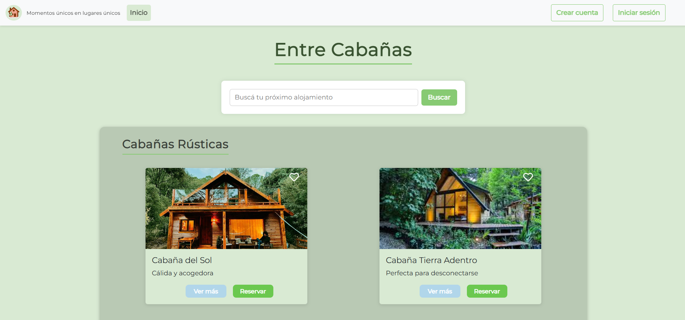

# 🏕️ Cabin Booking App – Full Stack (React + Spring Boot)


## 📖 Descripción
Plataforma web para la **gestión y reserva de cabañas turísticas**.  
- Usuarios: pueden explorar cabañas por categoría, ver detalles, consultar disponibilidad y realizar reservas.  
- Administradores: gestionan el catálogo de cabañas (alta, edición, eliminación) y visualizan reservas y calificaciones.

---

## 🛠 Tecnologías
**Backend:** Java 17, Spring Boot, Spring Security, JPA/Hibernate, H2  
**Frontend:** React, TypeScript, CSS  
**Otros:** JWT (autenticación), SMTP (envío de emails)

---
### Home


### Video Vista de Usuario
[Ver demo en YouTube](https://youtu.be/rSPA6i2iau0)

---

## 👤 Usuarios de prueba
| Usuario | Contraseña | Rol |
|---------|------------|-----|
| usuario@email.com | usuario123 | ROLE_USER |
| admin@email.com | admin123 | ROLE_ADMIN |

---

## 🎯 Objetivos del proyecto
- Facilitar la reserva de cabañas según preferencias del usuario.  
- Proveer interfaz **intuitiva y responsive** para desktop y móvil.  
- Organizar cabañas mediante categorías.  
- Gestionar catálogo desde panel administrativo.  
- Integrar **notificaciones vía email**.  
- Consultar y gestionar historial de reservas y calificaciones.

---

## 🧑‍🤝‍🧑 Stakeholders
- **Usuarios finales:** turistas interesados en alquilar cabañas.  
- **Equipo administrativo:** gestión del catálogo.  
- **Equipo de desarrollo:** diseño, desarrollo, pruebas y mantenimiento.  
- **Scrum Master:** coordinación y planificación.  
- **UX/UI:** diseño visual, paleta de colores e identidad.  
- **Testing:** planificación y ejecución de pruebas.  
- **Team Leads:** responsables de repositorios y calidad de cada módulo.

---

## ⚠️ Restricciones
- Accesible vía web con diseño **responsive**.  
- Base de datos local **H2** para desarrollo.  
- Seguridad básica implementada (autenticación).  
- Tiempo limitado: sprint centrado en funcionalidades básicas.  
- Emails de prueba configurados con cuenta SMTP.

---

## 🚀 Cómo ejecutar el proyecto
1. Clonar el repositorio:
   ```bash
   git clone https://github.com/vgutierrezz/Cabin_Booking_App.git
